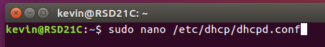
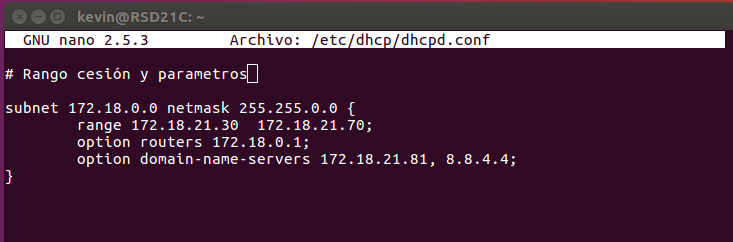

# T2-A3: Servidor DHCP en Linux

En esta práctica vamos a configurar un servidor DHCP en una máquina con sistema operativo Ubuntu. Esta servirá de manual de instalación y configuración para futuras consultas.

## 1. Instalación del servicio DHCP

En este apartado simplemente instalaremos el servicio en nuestro servidor Linux, para ello nos dirigimos a una terminal y escribimos el comando **"apt-get install isc-dhcp-server"**.

Podemos comprobar que se ha instalado el servicio ejecutando el comando **"service isc-dhcp-server status"**, por el momento nos mostrara un fallo debido a que no esta configurado el servicio.

## 2. Configuración del servicio DHCP

Ha llegado el momento de configurar nuestro servidor, para esto podemos modificaremos el fichero **"/etc/dhcp/dhcpd.conf"**.

### 2.1 Creación de un ámbito nuevo

En el fichero de configuración podemos especificar todo lo que necesitamos, lo primero será crear un nuevo ámbito, para ello creamos una subnet y la configuramos como se muestra en la siguiente captura:

En la imagen podemos observar que ya tenemos servidores DNS suministrados a los clientes de la subnet o el gateway por defecto.

> A partir de esta parte de la práctica asegura que la tarjeta de red este en modo "red interna"

> 

También podemos configurar parámetros globales y otras opciones dentro del ámbito.

### 2.2 Creación de una reserva

Para crear una reserva dentro de nuestro servidor debemos asignarla fuera de nuestro ámbito. Primero tendremos que verificar dos apartados:

* Comprobar la dirección MAC de nuestra máquina cliente.

* Comprobar que nuestra tarjeta de red se encuentra en modo "red interna" y comparte red con nuestro servidor.

Tras esto creamos el host "ClienteUbuntu" y encerramos entre llaves los parámetros que queramos para el host.

> En esta última captura modifique la "subnet" porque me pareció más conveniente para el rango utilizado. Entre los parámetros destacados en la reserva de host destaca:
>*  En "hardware ethernet" escribiremos la dirección MAC del equipo.
>* En "fixed-address" la IP que queremos reservar para el equipo.

Por último reiniciamos el servicio y pasamos comprobar que funciona.

## 3. Comprobaciones finales

Llego la hora de comprobar si el servicio funciona correctamente, para esto encendemos nuestra MV cliente y reiniciamos la tarjeta de red.

La IP asignada es la **172.18.21.45**, que fue la que seleccionamos para la reserva, por lo que todo va bien.

En la siguiente captura también podemos comprobar que el gateway así como los servidores DNS están configurados correctamente.

Una vez comprobado que el servicio funciona correctamente podemos dar por finalizada esta práctica.
