>Trabajo Realizado por:
>
>[Noelia Hernández Domínguez](https://github.com/NoeClariNista/srd/blob/master/trim1/u2/dhcp_failover_en_windows_2012_server.md)
>
>[Roberto Hernández Sanabria](https://github.com/xxkiroxx/servicios-red-internet/blob/master/trim1/u1/a3-dhcp-failover-windows/README.md)
>
>[Kevin Hernández García](https://github.com/KeyMax14/rsd1718-kevin/blob/master/trim1/u2/a4-DHCP-Failover/README.md)

# DHCP Failover Windows Server 2012

En esta actividad vamos a configurar un servidor complementario al de la actividad anterior que nos permita establecer un servicio `DHCP Failover`, el cual consiste en tener un segundo servidor DHCP que funcione de respaldo a nuestro servidor principal. Para elaborarlo realizaremos los siguientes pasos:

- [1. Agregar un segundo Servidor](#1)

- [2. DHCP del Servidor Principal](#2)

    - [2.1. Configuración conmutación por error ( DHCP Failover)](#3)

    - [2.2. DHCP secundario](#4)

    - [2.3. Equipo Cliente](#5)

- [Captura con el Servidor DHCP Principal suministrando IP al Equipo Cliente](#6)

- [Captura con el Servidor DHCP Secundario suministrando IP al Equipo Cliente](#7)

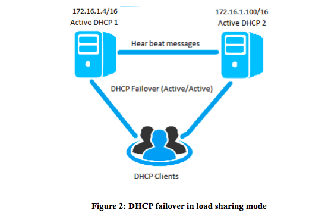

## 1. Agregar un segundo Servidor

Lo primero que haremos será incluir el segundo servidor dentro del dominio de nuestro servidor principal, para esto nos dirigimos a la ventana `Administrador del Servidor` -> `Agregar otros servidores para administrar` en el servidor **principal**.

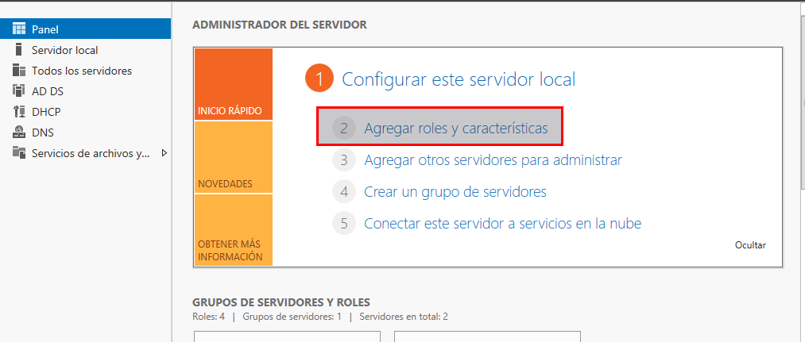

Tras esto solo tenemos que darle buscar ahora, te salen los servidores disponibles, seleccionamos el servidor y le damos a la flecha para pasarlo para el cuadro de la derecha. Los servidores ya se conocen entre ellos, dentro de su directorio activo.

## 2. DHCP del Servidor Principal

De la práctica anterior conservamos dos ámbitos de DHCP en el servidor principal. Mientras que en nuestro servidor secundario no tenemos creado ningún ámbito, esto cambiara cuando conmutemos uno de los ámbitos que ya disponemos.

- DHCP del Servidor Principal

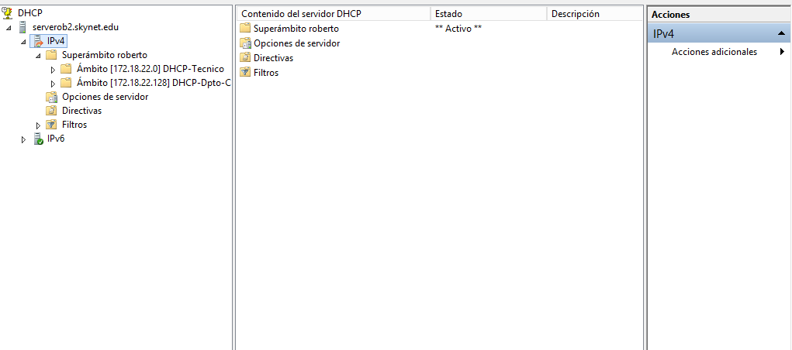

- DHCP del Servidor Secundario

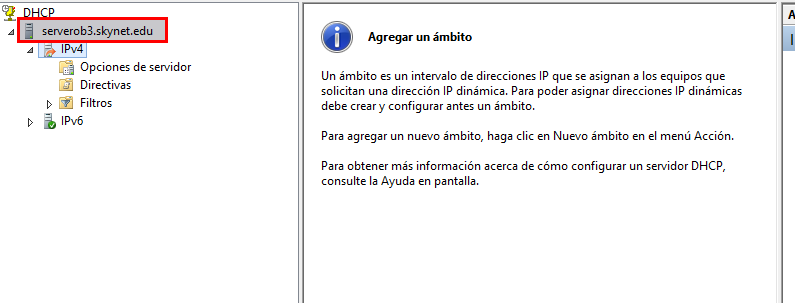

### 2.1. Configuración conmutación por error (DHCP Failover)  

Ha llegado el momento de generar el `DHCP Failover`, para ello pulsamos el botón secundario del ratón en el servidor principal y seleccionamos configurar conmutación por error.

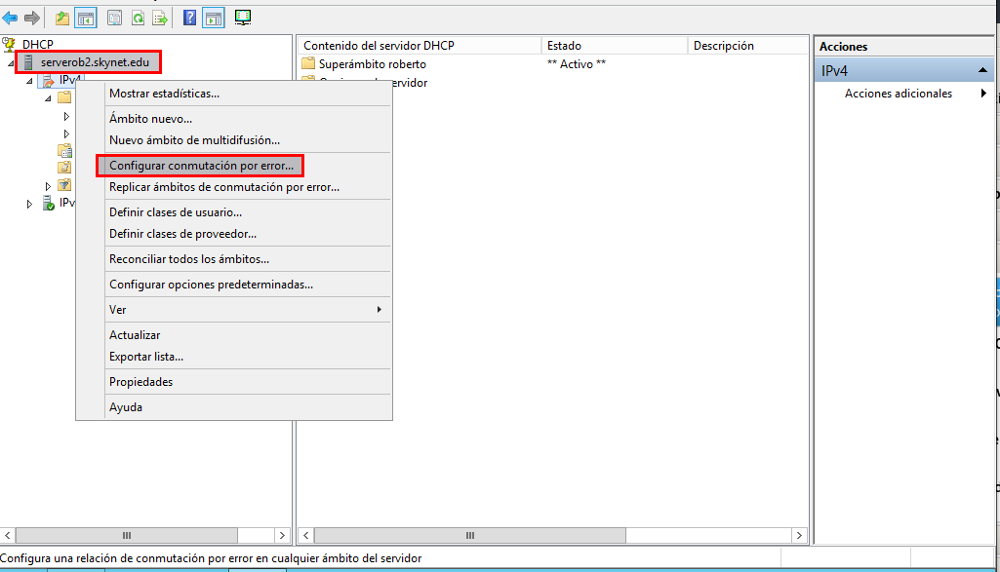

Se nos abre una nueva venta en la que seleccionamos los ámbitos que queramos conmutar.

Tenemos que buscar el servidor secundario para que pueda pasar toda la información de la configuración de los ámbitos, esto lo podremos hacer introduciendo la IP de `serverob3` o buscando el nombre de host del equipo en la red de equipos.

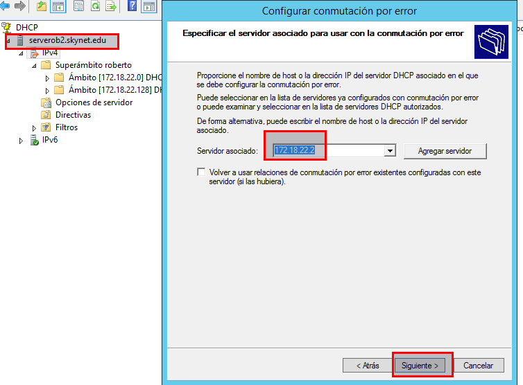

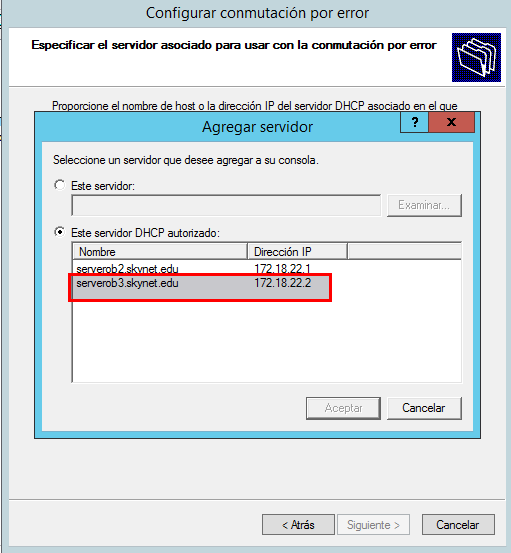

Seleccionamos el servidor secundario, le damos aceptar y se nos abrirá una nueva ventana para crear una nueva relación. Existen varios modos de conmutación por error, estos son:

- Equilibrio de carga.

-  Espera activa.

      - Por defecto espera.
      - Por defecto activa.

En el modo `equilibrio de carga`, el trafico de clientes por defecto se reparte 50-50 entre ambos servidores, si nuestro objetivo es repartir la carga de los equipos equilibradamente puede ser el que deseemos. A parte si uno de los dos servidores no funciona o no esta disponible, el servidor restante se encargará de todo el tráfico entrante.

También podemos configurarlo en el modo de `espera activa "espera"`. Si configuramos está opción el servidor secundario se queda a la espera de que falle el servidor principal de DHCP y no reparte direcciones hasta que esto ocurre.

El modo de `espera activa "activa"`. Si configuramos está opción el servidor secundario está siempre activo, falle o no el servidor principal.

### Eliminación de Conmutación por error

En el caso de que queramos borrar los servidores de conmutación por error solo tenemos que seleccionar el protocolo IPv4, le damos propiedades, seleccionamos la pestaña conmutación por error y eliminamos las existente.

### 2.2. DHCP secundario

Una vez realizado todos los ajustes pertinentes en nuestro servidor principal solo tendremos que darle a actualizar en el servidor DHCP secundario.

Tras esto ya nos aparecerán los ámbitos del DHCP principal.

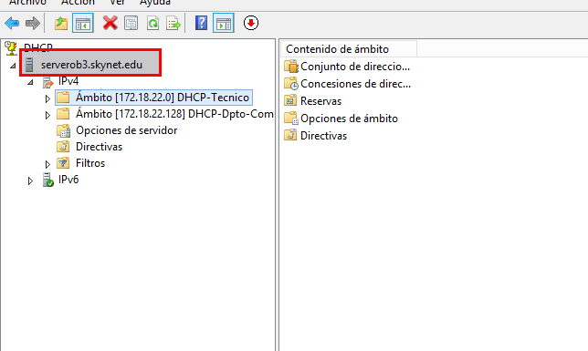

## 2.3. Equipo Cliente

Ha llegado el momento de comprobar que nuestro servidor `DHCP Failover` funciona correctamente, para esto nos dirigimos a nuestra máquina cliente y reiniciamos la tarjeta de red.

- Realizamos un `ipconfig /release` y `ipconfig /renew`

- Realizamos un `ipconfig /all`

Con este último comando comprobamos que el Servidor DHCP principal es el que nos cede la dirección IP.

Para simular un fallo del servidor DHCP Principal, desactivamos el DHCP principal.

- Realizamos de nuevo un `ipconfig /release` y `ipconfig /renew`

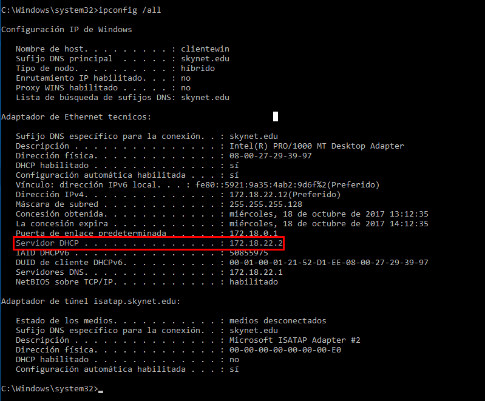

Esta vez es el servidor secundario DHCP el que nos está dando la dirección IP.

## Captura con el Servidor DHCP Principal suministrando IP al Equipo Cliente

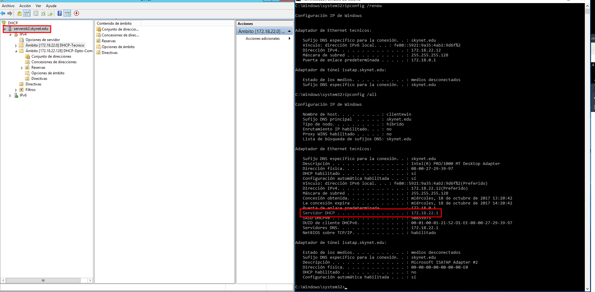

## Captura con el Servidor DHCP Secundario suministrando IP al Equipo Cliente

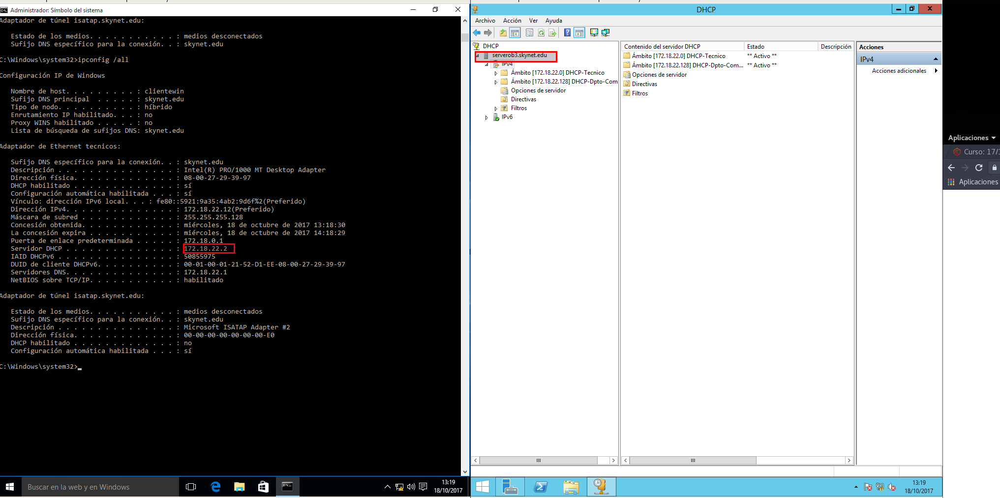

Con esto damos por finalizada la actividad.
