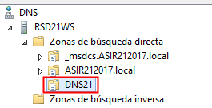
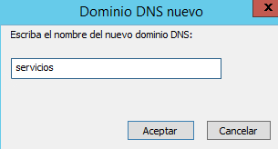
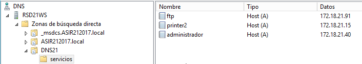

# Instalación y configuración DNS Windows 2012 server

En este actividad vamos a instalar y configurar un servidor DNS en una máquina con Windows 2012 Server. A continuación veremos los pasos y la prueba de funcionamiento de la misma.

## 1. Instalación del servicio DNS

En nuestro caso podemos saltarnos este paso porque al instalar `Active directory` en las máquinas se activa por defecto, en caso contrario deberemos añadir `servicios DNS` en `agregar roles`. Aun así estableceremos las IPs a nuestro servidor para que lo localicen desde los clientes en la práctica.

- Servidor:

- Cliente:

> El cliente no tiene porque tener una IP estática, pero decidí hacerlo así por que al momento de encender la máquina habían muchos compañeros compartiendo su ámbito DHCP.

## 2. Configuración del servicio DNS

Una vez instalado el servicio podemos configurarlo desde `administrador del servidor` -> `Herramientas` -> `DNS`

### 2.1. Zona de búsqueda directa

Lo primero que haremos será crear una zona de búsqueda directa, con esta podremos configurar todas las IPs que queremos traducir con sus registros `A`, `CNAME`, `MX`... etc.

Podemos dejar la configuración estándar

> Este será el nombre de nuestra zona.

### 2.2. Zona de búsqueda inversa

Vamos a crear una nueva zona, esta vez una zona inversa, la cual guardará la información del nombre que se le da a las direcciones IP con registros `PTR`.

Nuevamente podemos realizar una configuración estándar, indicando nuestra red al final.

## 3. Configurar reenviadores

Ahora vamos a configurar los reenviadores de nuestro servicio DNS. Estos reenviadores funcionan de manera que cuando nuestro servidor no encuentra las direcciones en sus zonas reenvía la petición a otros servidores DNS que le hayamos indicado.

Dentro de está opción podemos añadirle nuestra puerta de enlace y/o un DNS público como `8.8.8.8`.

### 3.1. Comprobar que funciona como DNS caché

Ahora que hemos configurado los reenviadores nuestro servidor debería poder comportarse como un DNS caché, por lo para comprobar que funcionan intentaremos acceder a sitios web en internet.

En las imágenes se puede comprobar con `nslookup` que el servidor DNS de la máquina es el de nuestro servidor, y que a través de él podemos acceder a sitios web que no se encuentran especificados en el mismo.

## 4. Configurar el servidor como DNS Maestro

Ahora vamos a configurar nuestro servidor como DNS maestro, para eso vamos a crear varios registros dentro nuestra zona de búsqueda directa. Estos registros serán:

1. Un alias para nuestro servidor denominado `server`.

      - Para establecer un alias en nuestro servidor primero crearemos un registro `A` para el mismo.

        

        

      - Después de eso ya podemos crear el registro `CNAME` donde escribiremos el alias de nuestro servidor.

        

        

        

2. Una impresora con IP fija denominada `printer`, sin necesidad de alias.

    - Para esto solo tenemos que añadir un registro `A`.

        

        

3. Un servidor de correo denominado `correo`, asociado a una dirección en nuestro servidor.

    - En versiones anteriores a Windows 2012 server se permitía configurar un servidor de correo asignándole directamente una IP, pero en nuestro caso tendremos que hacer primero un  registro `A`.

      

    - Una vez hecho esto crearemos un registro `MX` para configurar la información del servidor de correo.

      

      

      

Por último vamos a crear una subzona denominada `servicios`, para esto pulsamos clic derecho en las opciones de nuestra zona directa y seleccionamos `Dominio nuevo`.

Una vez generada la subzona añadiremos a nuestro servidor DNS lo siguiente:

1. Un servidor ftp (asociado a la misma IP de nuestro servidor).

    

2. Una impresora nueva (Con una IP fija).

    

3. El equipo del administrador del sistema (Con una IP fija).

    

## 5. Comprobaciones desde el servidor

Una vez que configurado nuestro `DNS Maestro` vamos a comprobar que resuelve correctamente desde una consola desde el propio servidor.

Para esto utilizaremos el comando `nslookup`.

- `Server` y `Printer`:

- `Correo`:

> En este podemos utilizar el comando `nslookup -type=mx` para ver el nombre del servidor de correos.

- Dentro de la subzona `servicios`:

## 6. Validar un cliente en el Dominio

Una vez comprobado que nuestro servidor DNS opera correctamente desde nuestro servidor probaremos a validar un cliente en nuestro Dominio. A la hora de validar el cliente podemos comprobar desde la configuración de nuestro DNS que en el dominio se crea un nuevo registro `A` para este.

### 6.1. Comprobaciones desde el cliente

Al igual que con el servidor vamos a comprobar que funcionan nuestros registros desde el cliente utilizando nuevamente el comando `nslookup`.

#### 6.1.1. DNS Master

- `Server` y `Printer`:

- `correo`: (`nslookup -type=mx`)

- Dentro de la subzona `servicios`:

#### 6.1.2. DNS caché

También comprobaremos que nuestro servidor funciona como `DNS caché` probando direcciones de sitios web públicos.

- `Facebook`:

- `Google`:

- `Forocoches`:

Una vez comprobado todo esto podemos dar por finalizada esta actividad.
