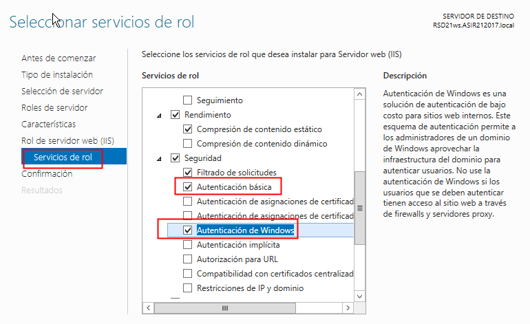

# U4-A1 Práctica de IIS Windows 2012 Server I

En esta actividad vamos a instalar el servidor web IIS (`Internet Information Server`) en una máquina con Windows 2012 server. En este primer informe vamos a realizar la instalación y configuración del mismo, así como la creación de los primeros sitios web de ejemplo.

## 1. Instalación ISS

Lo primero que tenemos que hacer es instalar el servidor, para ello nos dirigimos a `administrador del servidor` -> `Agregar Roles`. Desde ahí seleccionaremos `servidor web (IIS)`.

> A la hora de realizar la instalación complementariamente habilitamos los servicios de rol `Autenticación básica` y `Autenticación de Windows`.
>
>

Tras esto simplemente dejamos por defecto las opciones en el asistente y esperamos a que se instale en nuestra máquina.

## 2. Comprobar que podemos acceder a la web por defecto

Al terminar la instalación el servicio configura directamente una web por defecto en el `puerto 80` de nuestro servidor, en este punto comprobaremos que podemos acceder a la misma desde nuestro servidor o desde los clientes.

- Desde nuestro servidor podemos hacer esto intentando acceder a `localhost` desde el navegador.

  

- Desde un cliente probaremos que podemos acceder escribiendo la IP de nuestro servidor, en este caso `"172.18.21.91"`, o mediante el nombre principal del domino así como los alias del mismo.

  - IP:

    

  - Nombre de Dominio:

    

    

## 3. Agregar host `www` al Dominio

Una gran cantidad de webs establecen una redirección desde el host `www` al dominio principal, esto lo hacen porque es muy común que los usuarios intenten entrar directamente a este host porque así lo han aprendido.

Esto es lo que sucede si intentamos entrar a `www.asir212017.local` desde un navegador.

El resultado es que este host no existe, por lo que no se puede acceder al mismo. Para que este host sea accesible podemos añadirlo como alias del nombre principal de dominio en nuestro servidor `DNS`.

Tras esto ya podremos acceder a nuestra web utilizando el host `www`.

> **Nota:** A la hora de que el host funcione puede dar algún problema, esto puede deberse a que tarda en establecerse la información del DNS. Probar que funciona con el comando `nslookup` o realizando `ping` al nombre en concreto, en el caso de que estos resuelvan es que no hay ningún problema y al esperar acabara funcionando correctamente.

## 4. Cambiar página principal por defecto

En el caso de que queramos cambiar la página principal por defecto que nos ofrece el programa tendremos que dirigirnos a la ruta `C:\inetpub\wwwroot`.

En este directorio encontraremos el `html`, así como una imagen que utiliza de recurso la página por defecto. Si queremos modificar esta página solo tendremos que crear un `index.htm` con la configuración que queramos.

Tras esto ya podemos comprobar que podemos entrar usando tanto el nombre del dominio principal como sus alias desde el servidor y el cliente.

- Servidor:

  

  

- Cliente:

  

  

## 4.1. Creación de un pequeño sitio Web

Ahora que ya sabemos como modificar la página por defecto vamos a crear un pequeño sitio web compuesto de subpáginas e imágenes.

La estructura será la siguientes:

- El `index` principal estará en el directorio `C:\inetpub\wwwroot`.
- Las subpáginas estarán en el directorio `C:\inetpub\wwwroot\subpaginas`
- Las imágenes se encontraran en el directorio `C:\inetpub\wwwroot\img`

Tras generar la estructura podemos crear dos páginas sencillas donde se utilicen todos los recursos.

- `index.html`:

    

- `perros.html`

    

Una vez realizado el esquema podemos comprobar que en el `Administrador de Internet Information Services` se ha generado la estructura de nuestro sitio web para `Default Web Site`.

Si esto es así deberíamos poder acceder a nuestra sitio web desde el servidor y el cliente.

- Servidor:

    

    

- Cliente:

    

    

Hecho esto damos por finalizada la primera parte de la actividad.
