# U4-A1 Práctica de IIS Windows 2012 Server II

En esta segunda parte de la actividad vamos a ver como podemos crear sitios Web independientes en ISS.

## 1. Creación de un nuevo dominio DNS

Aunque opcional para la creación de sitios web independientes, en esta actividad vamos a crear un nuevo dominio DNS donde colocaremos las dos webs que vamos a crear.

Para crear el domino solo tendremos que ir en `administrador del servidor` -> `Herramientas` -> `DNS` y agregamos una nueva zona DNS, en mi caso la llamaré `miempresa21.edu`.

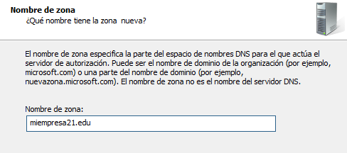

Dentro de esta zona añadiremos como registro `A` la IP de nuestro servidor.

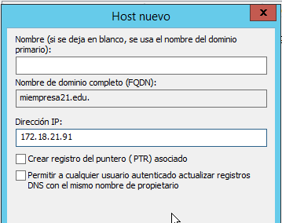

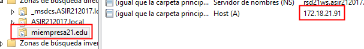

Al mismo tiempo también podemos crear el registro `A` para el segundo sitio web, que en este caso será un subdominio de `miempresa21.edu` que llamaremos `pepe`.

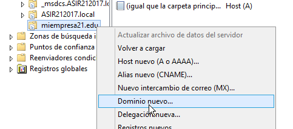

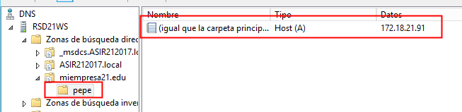

## 2. Creación de los sitios web

Como ya indicamos previamente vamos a crear dos sitios web, en mi caso creare:

- `miempresa21.edu`

- `pepe.miempresa21.edu`

Antes de dirigirnos a las herramientas del servidor `IIS` vamos a crear las carpetas contenedoras de los diferentes archivos de nuestra web en `C:\`.

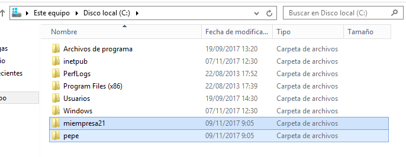

Una vez hecho esto nos dirigimos a las herramientas de `IIS` y en el `sitios` agregamos un nuevo sitio web.

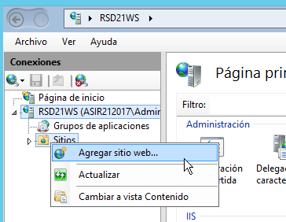

Añadiremos los dos sitios, en cada uno se nos pedirá la `ruta de acceso física` y el `nombre de host`.

- `miempresa21.edu`:

    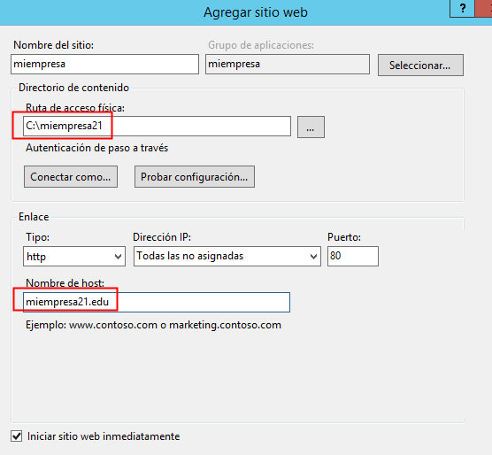

- `pepe.miempresa21.edu`

    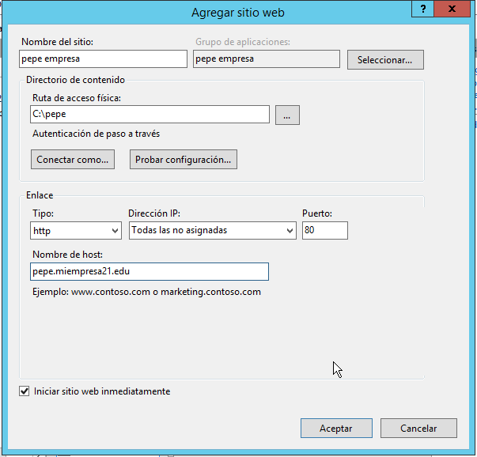

Al realizar esto en sitios nos debería aparecer esto:

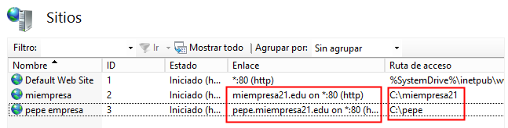

### 2.1. Creación de directorios

Las páginas ya están levantadas en nuestro servidor pero aún no tenemos definida ninguna configuración dentro de ellas, así que en este punto vamos a incorporar algunos archivos `HTML`, `imagenes` y `subdirectorios` en ambos sitios.

- `C:\miempresa21`:

    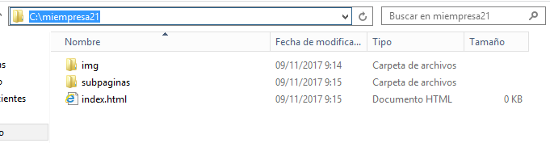

    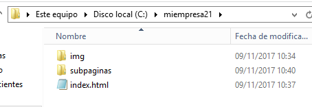

    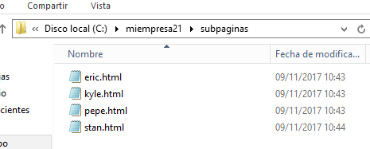

    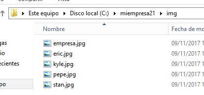

- `C:\pepe`:

    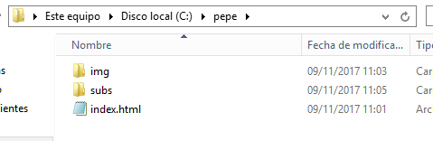

    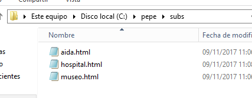

## 3. Comprobar el funcionamiento de las Web

Vamos a probar que las webs funcionan accediendo tanto desde el servidor como desde el cliente.

- Servidor:

    - `miempresa21.edu`

      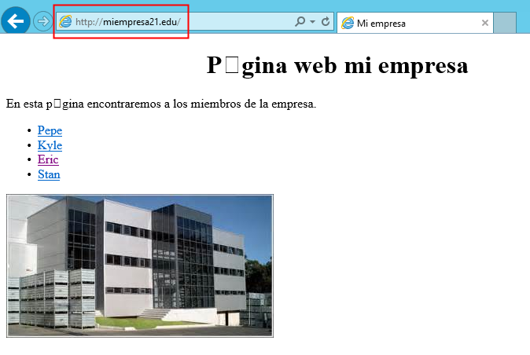

      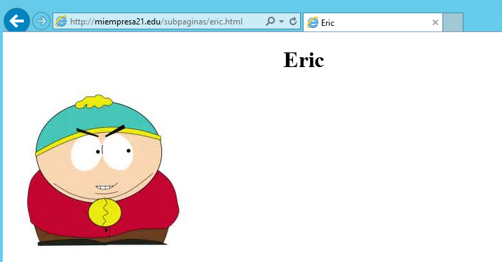

    - `pepe.miempresa21.edu`

      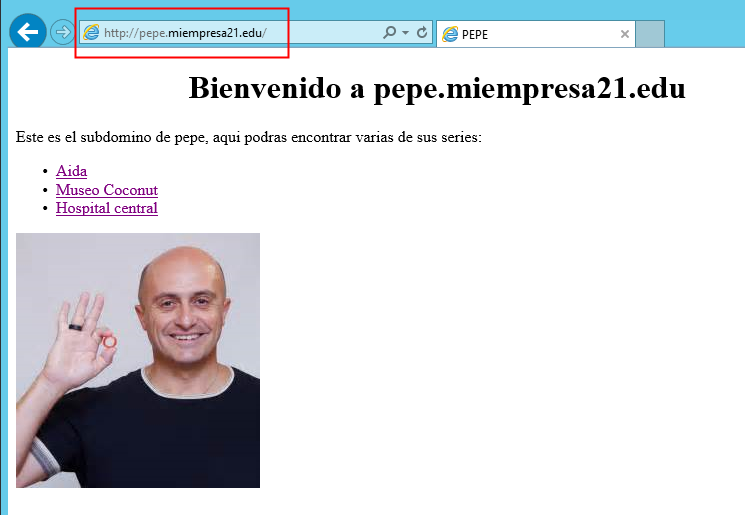

      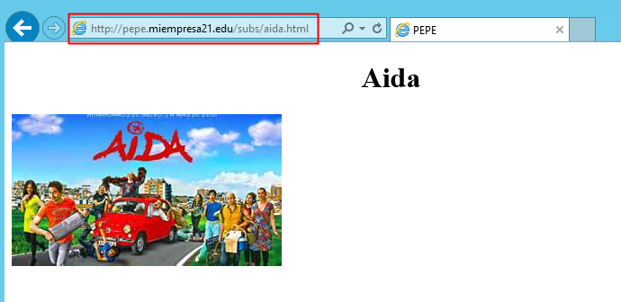

- Cliente:

  - `miempresa21.edu`

    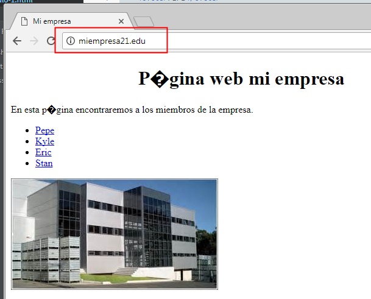

    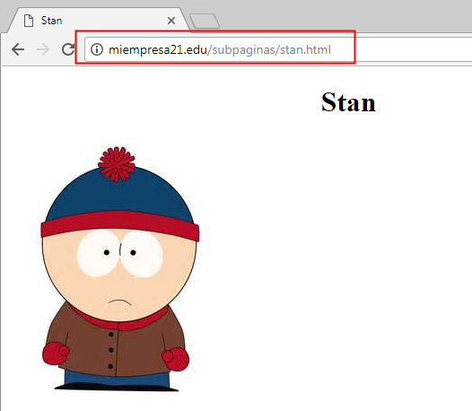

  - `pepe.miempresa21.edu`

    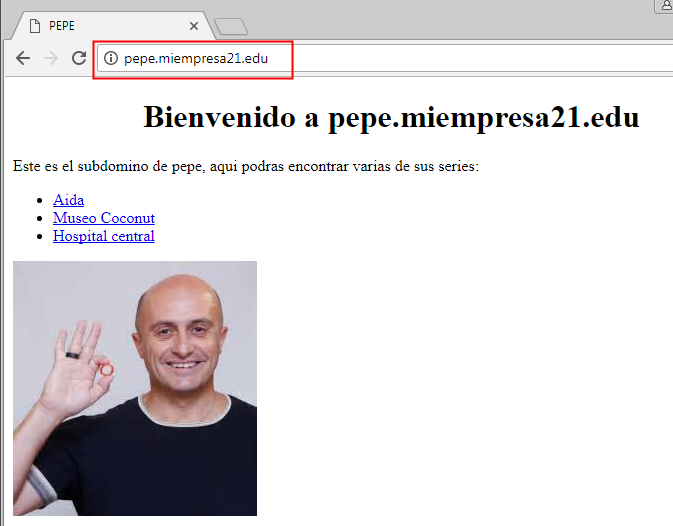

    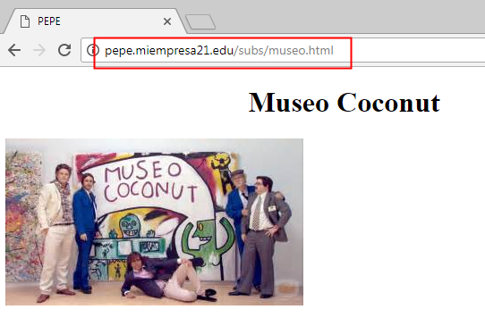

Comprobado que funciona podemos dar por finalizada la segunda parte de la actividad.
