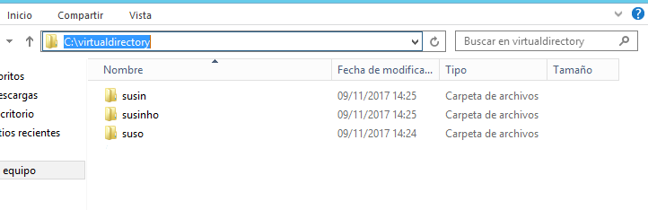
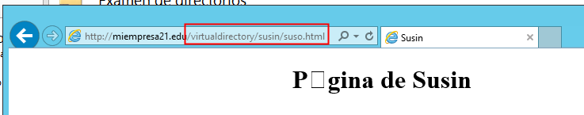

# U4-A1 Práctica de IIS Windows 2012 Server III

En la segunda parte pudimos ver como se implementaba nuevos sitios webs en un servidor IIS, esta vez vamos a ver como se implementan `Directorios virtuales` en este.

## 1. Creación del Directorio virtual

Los `directorios virtuales` son carpetas independientes que se pueden vincular a un sitio web en concreto. Para crear estas carpetas nos dirigimos al sitio web en cuestión desde el gestor de `IIS` y seleccionamos `Agregar directorio virtual`.

Y dentro de este menú seleccionamos el alias con el que se accederá desde el dominio (uri) y la ruta física del mismo, que será una carpeta que crearemos en nuestro equipo previamente.

> Nótese que el directorio es 'hermano' a las rutas de nuestros sitios web, demostrando así su independencia de la web a la que pertenecerá.

Hecho esto el directorio ya será accesible desde `http:/miempresa21.edu/virtualdirectory`, aunque de momento no esta configurado.

## 2. Preparar el contenido de `C:\virtualdirectory`

Ahora vamos a diseñar nuestra web, tiene que contener 3 directorios, en mi caso serán:

- `suso`.

- `susin`.

- `susinho`.

Dentro de cada uno de estos crearemos un `html` propio.

> Podemos ver que en el directorio principal no he puesto un `index`, esto lo he hecho con el propósito de probar el `autoindex` de `IIS` y que el contenido de la carpeta se muestre como una especie de `FTP`.
>
>- Para hacer esto seleccionando nuestro directorio virtual habilitamos `Examen de directorios`.
>
>   
>
>   

## 3. Comprobar el funcionamiento del directorio

Para finalizar vamos a probar que podemos visualizar nuestro directorio desde el servidor así como del cliente.

- Servidor:

  

  > Aquí también podemos ver el funcionamiento del examen de directorios.

  

- Cliente:

  

  

Comprobado el funcionamiento del directorio podemos dar por finalizada esta actividad.
