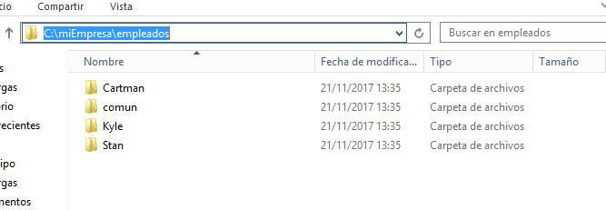
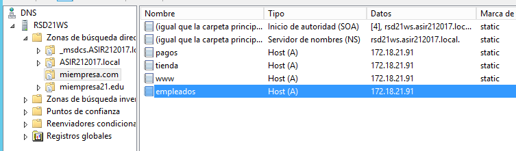

# U4-A2-B Práctica de IIS Windows 2012 Server

## Instalación y Configuración de un Servidor Web Avanzado Internet Information Server – Carpetas Privadas

En esta práctica vamos a generar un numero de carpetas privadas dentro de nuestra web, con las que solo podrán acceder determinados usuarios de nuestro servidor.

Para ello vamos a crear un nuevo sitio web `empleados.miEmpresa.com` destinado a almacenar información privada de los empleados.

### 1. Crear la dirección fisica de la web

Antes de comenzar vamos a diseñar las rutas donde se situara nuestra página web, esta la localizaremos en:

- `C:\miEmpresa\empleados`:

Dentro de esta vamos a crear un conjunto de carpetas para los empleados y una global para todas estas que llamaremos `comun`.

Y como siempre antes de crear nuestra página web vamos a añadir a nuestro servidor `DNS` un registro A.

### 2. Crear sitio web
