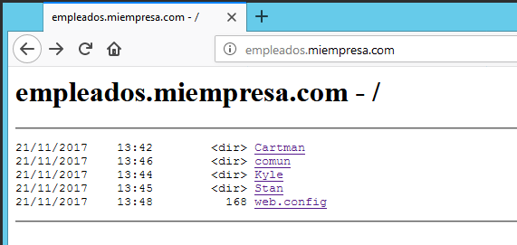

# U4-A2-B Práctica de IIS Windows 2012 Server

## Instalación y Configuración de un Servidor Web Avanzado Internet Information Server – Carpetas Privadas

En esta práctica vamos a generar un numero de carpetas privadas dentro de nuestra web, con las que solo podrán acceder determinados usuarios de nuestro servidor.

Para ello vamos a crear un nuevo sitio web `empleados.miEmpresa.com` destinado a almacenar información privada de los empleados.

## 1. Crear la dirección fisica de la web

Antes de comenzar vamos a diseñar las rutas donde se situara nuestra página web, esta la localizaremos en:

- `C:\miEmpresa\empleados`:

Dentro de esta vamos a crear un conjunto de carpetas para los empleados y una global para todas estas que llamaremos `"comun"`.

Y como siempre antes de crear nuestra página web vamos a añadir a nuestro servidor `DNS` un registro A.

## 2. Crear sitio web

Ahora vamos a crear el sitio web, para ello nos dirigimos a al administrador de `IIS` y añadimos `empleados.miempresa.com`.

Para probar nuestro sitio web vamos a añadir a cada uno de las subcarpetas un `index.html` y activaremos en la carpeta principal `C:\miEmpresa\empleados` el `examen de directorios` para que se vean las carpetas auto indexadas.

> **Nota:** Para ver rápidamente el contenido de las subcarpetas en Windows podemos desde un terminal ejecutar `"TREE <unidad><ruta> /F /A"`

### 2.1. Comprobaciones iniciales

Vamos a probar que las páginas funcionan rápidamente.

- `empleados.miempresa.com`:

  

- `empleados.miempresa.com/stan`:

  

- `empleados.miempresa.com/kyle`:

  

- `empleados.miempresa.com/cartman`:

  

- `empleados.miempresa.com/comun`:

  

## 3. Configurar acceso a las carpetas iniciales

Una vez comprobado que nuestras páginas funcionan correctamente debemos para cada una de las carpetas que queremos privatizar realizar las siguientes acciones:

      - Deshabilitar la `autenticación anónima` en cada subcarpeta.

      - Habilitar la `autenticación básica` en cada subcarpeta.

      - En la carpeta original permitir la `autenticación anónima`.

Para ello en cada apartado del sitio web debemos acceder a la opción `Autenticación`.

- `empleados`:

  

- `Cartman`:

  

- `comun`:

  

- `Kyle`:

  

- `Stan`:

  

## 4. Crear los usuarios y el grupo para autenticarse

Queremos que cada empleado pueda entrar en su carpeta personal de manera que esta le exija autenticarse con un usuario y contraseña, para ello debemos crear los usuarios `stan`, `kyle` y `cartman` como usuarios de `active directory`.

Para hacer esto nos dirigimos al `Administrador del servidor` y en herramientas seleccionamos `Usuarios y equipos de Active Directory`.

Dentro del menú que nos ofrece la herramienta tenemos que hacer clic derecho en `users` y seleccionar `Nuevo` -> `Usuario`.

Esto nos ejecutara un asistente que nos pedirá el nombre, la contraseña y otros parámetros para crear el usuario.

Repetimos el proceso con el resto de los usuarios hasta que tengamos todos los que nos hacen falta.

Así mismo crearemos un grupo llamado `empleados` que contendrá todos estos usuarios.

Con el grupo creado vamos a las propiedades del mismo y añadimos en la pestaña `Miembros` a nuestros tres usuarios.

## 5. Configurar el acceso a la carpeta física del sitio web

Para especificar que usuario puede acceder a cual carpeta debemos especificarlo desde las propiedades de seguridad de cada carpeta, lo primero que haremos será deshabilitar los permisos heredables de nuestra carpeta principal `C:\miEmpresa\empleados`.

Para ello nos dirigimos a las opciones de seguridad avanzadas de la carpeta y seleccionamos `Deshabilitar herencia`.

Para los permisos de la mismas añadimos `Administradores` con control total y el grupo `empleados` con permisos de lectura y ejecución, mostrar el contenido de la carpeta y lectura.

> **Nota:** Es posible que con esta configuración nos de problemas el `examen de directorios` en `empleados.miempresa.com`, para solucionarlo debemos añadir también al usuario `IIS_IUSRS` dentro de los usuarios con privilegios para esta carpeta.

### 5.1. Configurar el acceso a las carpetas físicas de cada empleado

De la misma manera que hicimos con la carpeta principal debemos deshabilitar la herencia para cada una de las subcarpetas de los empleados y asignar como usuarios privilegiados lo siguiente.

- `C:\miEmpresa\empleados\Cartman`:

  - Administradores con permisos de control total.
  - Usuario `Cartman` con permisos los permisos que creamos apropiados.

  

- `C:\miEmpresa\empleados\Kyle`:

  - Administradores con permisos de control total.
  - Usuario `Kyle` con permisos los permisos que creamos apropiados.

  

- `C:\miEmpresa\empleados\Stan`:

  - Administradores con permisos de control total.
  - Usuario `Stan` con permisos los permisos que creamos apropiados.

  

### 5.2. Configurar el acceso a la carpeta física `"comun"`

Al igual que con las anteriores deshabilitamos la herencia de esta carpeta. La diferencia con la demás será que no configuraremos ningún usuario privilegiado, sino que será el grupo `empleados`, ya que en esta carpeta buscamos que sea común para todos estos.

## 6. Comprobaciones finales

Vamos a comprobar ahora que todos las configuraciones funcionan correctamente tanto desde el servidor como desde un cliente.

### 6.1. Servidor

Primero comprobemos que podemos acceder a `empleados.miempresa.com`.

> En este punto es donde sabremos si debemos hacer uso de la anotación en el punto "2.".

Probemos que al acceder al empleado `Cartman` nos pide el usuario de este.

Una vez identificado nos deja acceder, al mismo tiempo podemos comprobar que acceder a `"comun"` también es posible sin tener que logearnos, ya que el usuario `cartman` pertenece al grupo empleados.

Sin embargo si intentamos acceder al empleado `Stan` nos pedirá nuevamente que nos identifiquemos con otro usuario, haciéndolo comprobamos que también es accesible con su usuario.

### 6.2. Cliente

Comprobemos que sucede lo mismo en un cliente con Windows 7.

- Acceder a la página principal.

  

- Acceder al empleado `Kyle` haciendo "login" con su usuario.

  

  

- Acceder a `"comun"` mientras estamos logeados con el usuario `kyle`.

  

- Acceder al empleado `Cartman` haciendo "login" con su usuario.

  

  

Una vez hechas todas esta comprobaciones podemos dar por acabada esta actividad.
