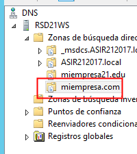

# U4-A2 Práctica de IIS Windows 2012 Server

En esta práctica  vamos a diseñar dos nuevos hosts para un nuevo dominio que llamaremos `miempresa.com` pero que dispongan de certificados SSL.

Las webs en cuestión serán:

- `https://pagos.miempresa21.edu`.

- `https://tienda.miempresa21.edu`.

## 1. Agregar zona de búsqueda directa y nuevo sitio web

Lo primero que tenemos que hacer es crear una zona de búsqueda directa en nuestro servidor DNS asociado al dominio `miempresa.com`.

Con nuestro servidor DNS ya configurado tenemos que crear el árbol de directorios donde estará ubicado nuestro sitio web, vamos a crear las carpetas `C:\miEmpresa` y dentro de esta el directorio `principal`.

Una vez hecho esto ya podemos dirigirnos al `administrador del servidor IIS` y agregar un nuevo sitio web:

- Este sitio web estará asociado a `C:\miEmpresa\principal`.
- Se accederá al mismo mediante el host `www.miempresa.com`.

## 2. Crear nuevos sitio web seguros

Una vez creada la que será nuestra página principal vamos a hacer un nuevo sitio web que denominaremos `pagos` y que será un subdominio de `miempresa.com`. Este será accesible de forma segura vía `https`. Para ello debemos:

- Crear el sitio web, asociándolo al directorio `C:\miEmpresa\pagos`.

  

  

- Configurar el servidor DNS para admitir peticiones a `pagos`.

  

Vamos a crear un `index.html` sencillo para comprobar que en principio podemos acceder mediante `http` a nuestra página.

> **Nota:** Para forzar que nuestro DNS no se demore a la hora de actualizar la información de nuestras paginas web podemos utilizar el comando `ipconfig /flushdns` para renovar la cache de nuestro servidor.

## 2.1. Autenticación `ssl` mediante certificados autofirmados

Ahora vamos a crear un certificados autofirmado con el que certificar nuestra página web.

Para ello nos dirigimos al `Administrador de IIS` y dirigirnos a `Certificados del servidor`. Una vez dentro del menú al lado derecho de la ventana veremos diferentes tipos de certificados que podemos crear, esta vez elegimos `Crear certificado autofirmado...`

Dentro de aquí solo tenemos que elegir un nombre para nuestro certificado, en mi caso `autofirmado21`, y ya estará disponible en nuestro servidor.

### 2.1.1. Asignación del certificado ya creado

Ahora solo tenemos que asignar nuestro certificado a la web en cuestión (`pagos`). Para ello hacemos clic derecho desde el administrador de ISS y pulsamos `modificar enlaces...`.

Aquí encontraremos el enlace de nuestro página especificado en el puerto 80 tipo `http`, tenemos que agregar un nuevo enlace que se encuentre en el puerto 443 tipo `https`.

A la hora de agregar debemos especificarle el certificado SSL que usaremos en la web.

Tras esto quitaremos el enlace hacia el puerto 80, para que nuestra página solo sea accesible mediante el enlace con SSL.

### 2.1.2. Comprobaciones

Vamos a acceder a `https://pagos.miempresa.com/` tanto desde el servidor como desde el cliente para comprobar que nuestra página funciona correctamente.

- **Servidor**:

  

  Lo primero que encontramos es que hay un problema con el certificado, esto es debido a que no existe ninguna entidad certificadora que nos lo haya expedido, por lo que no es seguro, y esto lo detecta el navegador.

  Entraremos al sitio web de todos modos para comprobar que funciona correctamente.

  

  

- **Cliente**:

  

  

  Con esto comprobamos que se puede acceder también desde el cliente, con el consecuente error con el certificado no seguro.

## 2.2. Certificación SSL mediante certificados digitales generados por OpenSSL

Ahora vamos a probar a crear un certificado mediante OpenSSL, simulando que una entidad certificadora firma nuestro certificado.

### 2.2.1. Crear nuevo host `tienda`

Antes de eso vamos a crear un nuevo subdominio que ubicaremos en `tienda.miempresa.com`. Para ello rápidamente:

- Configuramos un nuevo registro DNS.

  

  

- Creamos el directorio que contendrá la página de forma local.

  

- Agregamos el sitio web en `IIS` vinculándolo con lo anterior ya creado.

  

Podemos comprobar en primera instancia que funciona via `HTTP`.

- **Servidor**:

  

- **Cliente**:

  

### 2.2.2. Crear una solicitud de certificado digital

Antes que nada tenemos que dirigirnos nuevamente a `Administrador de IIS` -> `Certificados de servidor` y esta vez en vez de `Crear certificado autofirmado` seleccionar la opción `Crear una solicitud de certificado...`.

Desde aquí se nos pedirán datos:

- Información de nuestra organización.

  

- Las propiedades que tiene el proveedor de servicios criptográficos (Tipo de clave, longitud en bits de la misma...).

  

- La localización del fichero donde se guardara la solicitud, en un `.txt`.

  

  > Este archivo tendrá una clave cifrada de la solicitud.
  >
  > 

### 2.2.3. Instalar y utilizar OpenSSL

Ahora instalaremos OpenSSl, el cual simulará a una entidad certificadora generando los archivos necesarios.

Dependiendo del lugar donde lo instalemos tendremos que localizar la subcarpeta `bin` del programa donde podemos localizar `openssl.exe`. En mi caso particular se encuentra en `C:\OpenSSL\bin`, por lo que no dirigimos a ese directorio desde una consola de comandos y escribimos los siguientes comandos para crear los archivos que necesitamos.

- `openssl genrsa -des3 -out cakey.pem 2048`

  > Con este comando crearemos la clave privada para la CA, con la que se firmara la información enviada por el servidor. Tendremos que introducirle una contraseña de seguridad.

  

  Nos creará el siguiente archivo en la carpeta `C:\OpenSSL\bin`.

  

  

- `openssl req -new -x509 -key cakey.pem -out cacert.pem -days 365`

  > Con este comando crearemos un certificado digital de la CA que contendrá información sobre la misma. Este certificado será valido durante un año.

  

  Nos creará el siguiente archivo en la carpeta `C:\OpenSSL\bin`.

  

  

Para finalizar copiamos el archivo de solicitud que se creo previamente desde el Administrador de IIS (`certrequest.txt`) a la ruta donde se encuentran los otros ficheros que ya hemos creado (`C:\OpenSSL\bin`) y ejecutamos el siguiente comando.

- `openssl x509 -req -days 365 -in certreq.txt -CA cacert.pem -CAkey cakey.pem -CAcreateserial -out iis.crt`

  > Con este comando crearemos el certificado digital de nuestro sitio web, con el nombre `iis.crt`.

  

  Se nos creara el siguiente archivo.

  

  

### 2.2.4. Completar solicitud de certificado

Una vez tenemos el certificado digital de nuestro servidor nos dirigimos nuevamente a `Administrador de IIS` -> `Certificados de servidor` y pulsamos esta vez en `Completar solicitud de certificado...`.

Desde ahí seleccionaremos la ruta donde se encuentra nuestro certificado `iis.crt` y le ponemos un nombre descriptivo.

Con esto ya tendremos creado nuestro certificado firmado por OpenSSL, solo nos queda incluirlo en la página `tienda.miempresa.com` en un nuevo enlace, eliminando después de esto el enlace por `HTTP` para que solo sea accesible mediante `HTTPS`.

### 2.2.5. Comprobaciones

Solo nos queda comprobar que podemos acceder mediante `https://tienda.miempresa.com` a la web que hemos diseñado.

> Nos volvemos a encontrar con que no identifica el certificado como seguro.

Accediendo al certificado podemos comprobar que es valido durante un año, como le habíamos especificado anteriormente.

Con esto podemos dar por finalizada esta parte de la actividad.
