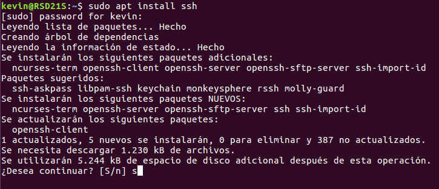
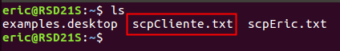

# U5-A1 Servidor FTP Linux


Esta es la continuación de la practica `U5-A1 Servidor FTP Windows`. En esta ocasión vamos a realizar la instalación y configuración del servicio FTP en una MV linux, concretamente con `ubuntu 16.04`.

## 1. Instalación del servicio SSH

Antes de pasar con un Servidor FTP al uso vamos a instalar `SSH`. Con este servicio seremos capaces de utilizar protocolos como `SFTP`. Para instalar el mismo ejecutaremos el comando `apt install ssh`.



Una vez instalado el paquete podemos comprobar que esta en nuestro sistema ejecutando el comando `ssh -V`,  comando el cual nos mostrará la versión del programa instalado.


## 2. Creación de clientes

Antes de comenzar a probar si funciona correctamente vamos a crear diferentes usuarios con los que loguearnos a `SSH`, uno de ellos tendrá rol de `administrador` y el otro será un usuario estándar.


En las siguientes capturas se ven los diferentes tipos de privilegios.


## 3. Conexión usando `SSH`

Ahora vamos a probar la conexión `SSH` haciendo uso de una MV cliente, en mi caso otra máquina con `Ubuntu 16.04`. Probemos a loguearnos con el usuario `eric` haciendo uso del comando `ssh eric@172.18.21.81`, donde el final es la IP de mi servidor.


También podemos intentar establecer una conexión con el usuario `stan`.


## 4. Ejecutar un aplicación grá0fica con `SSH`

Con `SSH` también podemos utilizar aplicaciones graficas que se encuentren en la MV servidor desde el cliente si activamos `X Forwarding`. Para esto debemos modificar el fichero `/etc/ssh/sshd_config`.


Dentro de este fichero debemos descomentar la línea `X11Forwarding yes` o escribirla nosotros mismos.


Ahora podemos iniciar sesión desde un cliente mediante `SSH` a nuestro servidor y hacer uso de las aplicaciones gráficas si iniciamos sesión utilizando el comando `ssh -X eric@172.18.21.81`.


Podemos comprobar que tenemos acceso a las aplicaciones gráficas ejecutando por ejemplo `gedit` desde la conexión `SSH`.


## 5. Conexión mediante SFTP

Instalando `SSH` como indique al principio de la practica también te permite realizar conexiones `SFTP`. Probemos a conectarnos desde la MV cliente.


> Haciendo uso del comando `get index.php` podemos comprobar que tenemos la posibilidad de descargar archivos.

Vamos a crear un archivo en nuestra MV cliente para comprobar que podemos subir archivos vía `SFTP`.


Haciendo uso del comando `put subir-sftp.txt` podemos comprobar que también nos permite subir archivos.


Esto también lo podemos hacer utilizando otro usuario, por ejemplo `stan`.


## 6. `SCP`

Otra herramienta de la que podemos hacer uso es de `SCP`, con esta herramienta podemos realizar copias seguras desde máquinas remotas.

En mi caso me voy a conectar a la máquina cliente y ejecutar el comando desde allí, desde aquí haremos copias desde el servidor al cliente y viceversa. La estructura es la misma que el comando `CP`.
```
scp 'ruta origen' 'ruta destino'
```
Y cuando nos conectemos a una máquina externa usamos la siguiente nomenclatura:

```
'usuario'@'host':'ruta remota'  # Por defecto la ruta del usuario es el home del mismo.
```

- Copiamos un archivo desde el home de `eric` a nuestro cliente.

  

  

- Copiamos un archivo desde el home de `stan` a nuestro cliente.

  

  

- Copiamos un archivo desde nuestro cliente al home de `eric` y al home de `stan`.

  

  

  

## 7. Instalar el servicio `proftpd`

Ahora vamos a instalar el servicio `proftpd`, con este servicio podemos hacer que los usuarios puedan acceder a nuestro servidor mediante `ftp`, con `proftpd` podemos hacer algunas restricciones dentro de este servicio como veremos más adelante, para instalar el servicio ejecutaremos el comando `sudo apt install proftpd`


A mitad de la instalación nos pedirá elegir entre `desde inetd` o `independiente` según el trafico que recibamos en nuestro servidor, en nuestro caso lo dejamos por defecto.


### 7.1. Configurar `proftpd`

Podemos modificar todo lo referido a `proftpd` desde el fichero `/etc/proftpd/proftpd.conf`, también podemos añadir archivos de configuración separados en la subcarpeta `/etc/proftpd/conf.d`.


Nosotros vamos a modificar en el fichero `proftpd.conf` descomentando la linea `DefaultRoot`, que es un parametro con el que podemos indicar el `home` de los usuarios, y el punto a partir del cual no pueden retroceder.


> Configuramos al usuario `eric` en su home y al usuario `stan` desde la raíz, ya que es un usuario con permisos de administrador.

Reiniciamos el servicio para que se refresquen los cambios.


### 7.2. Comprobaciones

Vamos a comprobar que funciona nuestro servicio FTP, lo primero que comprobaremos será acceder desde nuestro servidor.


> En esta última captura podemos observar que el usuario `eric` esta limitado solo a su home.

Ahora vamos a comprobar que se puede acceder desde el cliente.


> En este caso si es posible acceder a rutas anteriores a `/home/stan`, porque indicamos en el `DefaultRoot` de `stan` la ruta `/`.

Vamos a hacer algunas pruebas de subida y descarga de archivos utilizando nuestros dos usuarios desde el cliente:

- Usuario `eric`:

  - Descargamos un archivo desde `/home/eric` a nuestro cliente.

    

    

  - Subimos un archivo desde el cliente a `/home/eric` en remoto.

    

    

- Usuario `stan`:

  - Descargamos un archivo desde `/home/stan` a nuestro cliente.

    

    

    

  - Subimos un archivo desde el cliente a `/home/stan` en remoto.

    

Una vez hecho esto podemos dar por finalizada la actividad.
