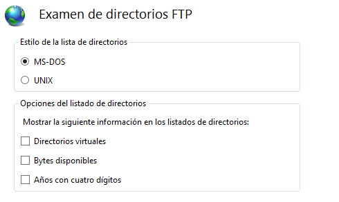
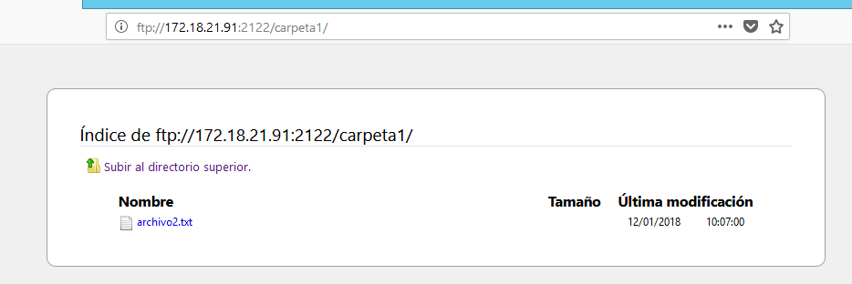

# U5-A1 Servidor FTP Windows

En esta practica vamos a instalar y configurar el servicio `FTP` en una máquina con **Windows server 2012**. En esta ocasión no vamos a instalar un servidor ftp externo como hicimos con `filezilla` en las practicas anteriores, sino que utilizaremos un servidor ftp que viene preinstalado como complemento adicional de `IIS`.

## 1. Instalar y acceder al servicio `FTP`

Para comenzar la practica lo primero que debemos hacer es instalar el servicio en nuestra MV, para ello nos dirigiremos al `administrador del servidor` y daremos clic en `agregar roles y servicios`.

Dentro de este menú debemos buscar el `servidor web (IIS)` y dentro del mismo habilitar el subrol `servidor FTP`.

Ahora solo debemos continuar la instalación por defecto y darle clic en `instalar`.

Una vez hemos hecho esto al entrar al `Administrador de IIS` nos podemos encontrar múltiples opciones que nos permitirán gestionar nuestros sitios FTP.

## 2. Creación de sitios `FTP`

En la actividad vamos a crear tres sitio distintos FTP, para agregar un nuevo sitio solo tenemos que hacer clic derecho en la pestaña sitios y pulsar en `Agregar sitio FTP...`.

### 2.1. Primer sitio FTP - `C:`

El primer sitio que vamos a crear esta asociado a la unidad `C:` completa, este sitio no podrá ser accesible por usuarios anónimos, no hará uso de certificados `SSL` y solo podrá acceder el usuario `Administrador` de nuestro servidor con permisos de lectura y escritura.

> En esta última captura cabe destacar que debemos seleccionar `autenticación básica`, de otra forma no nos será permitido acceder con el usuario `administrador` más adelante. Si se nos olvida siempre podemos modificarlo desde `autenticación FTP` en los menús que nos encontraremos al finalizar el sitio.
>
> 

Podemos comprobar que nuestro sitio esta funcionando accediendo mediante el navegador con la url `ftp://172.18.21.91`, que es la IP de mi servidor.

Cuando terminamos de crear nuestro sitio al acceder mediante `IIS` nos encontraremos con una multitud de opciones, veamos lo que hace cada una.

1. `Aislamiento de usuario FTP`

    - Esta opción nos permite aislar a los usuarios de manera que no puedan acceder a determinadas carpetas que se podrían encontrar en su sesión de otra manera, como pueden ser las carpetas personales de otros usuarios FTP.

      

1. `Autenticación FTP`

    - Esta opción ya la mencionamos en una anotación anteriormente, con ella podemos modificar el tipo de autenticación necesario para acceder a nuestro sitio FTP.

      

1. `Compatibilidad con el firewall de FTP`

    - Como dice la descripción que encontramos dentro de esta opción, la misma nos permite configurar nuestro sitio FTP para aceptar conexiones pasivas de un firewall externo.

      

1. `Configuración SSL de FTP`

    - Como nos indica el titulo en esta opción podemos modificar que nuestro servidor requiera o permita las conexiones SSL seleccionando el certificado necesario en cada caso.

      

1. `Examen de directorios FTP`

    - En esta opción podemos modificar parámetros de como se verá nuestro sitio FTP al acceder desde un navegador, así como la opción de añadir información adicional a cada archivo o directorio que se encuentre en él.

      

1. `Filtrado de solicitudes de FTP`

    - Desde esta opción se nos permite filtrar el contenido que será visible cuando se acceda al ftp, como podrían ser denegar la muestra de determinados archivos según su extensión, o la creación de segmentos ocultos.

      

1. `Mensajes de FTP`

    - Aquí podemos configurar diferentes mensajes que se le mostrarán a los usuarios del sitio ftp, como puede ser un mensaje de bienvenida o de salida.

      

1. `Registro FTP`

    - En este apartado se podrá configurar el sitio donde se guardan los registros de log del sitio FTP, así como la periodicidad de los mismos entre otras opciones.

      

1. `Reglas de autorización de FTP`

    - Con esta opción podemos visualizar los usuarios que tienen acceso a nuestro sitio FTP y los permisos de los mismos. A su vez también podemos añadir nuevos usuarios permitidos o reglas de denegación.

      

1. `Restricciones de direcciones IP y dominios de FTP`

    - Como su nombre indica, con esta opción podemos limitar que ciertos host puedan acceder o no a nuestro sitio FTP especificando su IP o el dominio al que pertenecen.

      

1. `Sesiones actuales de FTP`

    - En este apartado podemos ver a los usuarios que están conectados a nuestro sitio, y si es preciso acabar con su conexión.

      

      > Se puede comprobar debido a que podemos ver la sesión iniciada por de cuando probamos el acceso desde el navegador.
      >
      >

Sabiendo ahora como funcionan nuestros sitios FTP podemos comprobar que aparte de con el navegador también se puede acceder desde el explorador de archivos.

Vemos que nos ha solicitado la contraseña, para entrar ha sido necesario el usuario administrador de nuestro servidor, tal y como especificamos en la creación del sitio. Podemos comprobar también que disponemos de los permisos de lectura y escritura.

- Lectura:

  

- Escritura:

  

  

#### 2.1.1 Acceder desde un cliente

También tenemos que comprobar que nuestro sitio FTP es accesible desde un cliente, en mi caso utilizaré una MV con Windows 7.

- Navegador:

  

  

- Explorador de archivos:

  

  

  
  - Si accedemos a desde el administrador de nuestro sitio FTP a `sesiones actuales de FTP` podemos encontrarnos con la IP de nuestra máquina cliente.

    

  - Pruebas de lectura:

    

  - Pruebas de escritura:

    

    

Otra manera de acceder a nuestro sitio FTP es a través de un cliente FTP, en nuestro caso vamos a utilzar `WinSCP`, una herramienta que nos permite el acceso a sitios FTP, SFTP o hacer uso de SCP, un protocolo de copiado seguro.

Para instalar `WinSCP` accederemos a su página oficial https://winscp.net

Descargamos el programa y lo instalamos con las opciones por defecto.

Ahora que ya tenemos instalado `WinSCP` iniciaremos el programa y configuraremos una conexión a nuestro sitio FTP, que en este caso utiliza el protocolo `FTP` sin certificado, la `ip`  de nuestro servidor, el puerto `21` y el usuario `administrador` con su correspondiente contraseña.

Al darle clic a conectar podemos ver los archivos de la ruta `C:` de nuestro servidor. También podemos comprobar que seguimos teniendo permisos de escritura.

- Lectura:

  

- Escritura:

  

  

  

### 2.2. Segundo sitio FTP - `C:\inetpub\wwwroot`

Para la creación de nuestro segundo sitio FTP hemos seleccionado la ruta `C:\inetpub\wwwroot`, que es donde se encuentra la página por defecto de nuestro servidor web. En este sitio permitiremos el acceso a todos los usuarios de `active directory` con permisos de lectura y escritura. No permitiremos nuevamente el acceso a usuarios anónimos, y en esta ocasión "permitiremos" acceder mediante SSL con el certificado `autofirmado` que disponemos de la practica anterior.

- Primero creamos el sitio y le establecemos la ruta física.

    

- Lo siguiente que debemos hacer es indicar la IP y el puerto a utilizar, en mi caso para no tener que desactivar el sitio anterior decidí cambiar de puerto al `2121`. En este apartado también es donde seleccionaremos la opción de que se permita `SSL` así como el certificado.

    

    >En este apartado encontré varios errores por el hecho de seleccionar `habilitar nombres de host virtuales`, por lo cual más adelante decidí suprimir esta opción.
    >
    >  

- Por último seleccionamos permisos para todos los usuarios, la autenticación básica y los permisos de lectura y escritura para todos ellos.

  

#### 2.2.1. Comprobaciones de funcionamiento del sitio 2

 Ahora vamos a comprobar que funciona correctamente accediendo primero desde el servidor.

 - Navegador:

    - Probamos a entrar con el usuario `usu1`, perteneciente al `active directory`.

      

      

    - Podemos comprobar que efectivamente se ha iniciado sesión con el usuario `usu1` si lo buscamos en `sesiones actuales de FTP`

      

- Explorador de archivos:

    - Probamos a entrar esta vez con el usuario `usu2`.

        

        

Ahora vamos a comprobar que podemos acceder desde el cliente, en este caso pasaremos directamente a probar la conexión desde `WinSCP`, en la que estableceremos una conexión `SSL` haciendo uso del certificado.

> **Nota:** Al probar directamente el protocolo `SFTP` la conexión no se realizaba correctamente, por eso decidí utilizar el protocolo `FTP` con la clave de cifrado `SSL`.

Probemos a intentar copiar un archivo.

Con esto comprobamos que los permisos de escritura funcionan correctamente.

> **Nota:** Desde `WinSCP` podemos comprobar fácilmente que al hacer usos de puertos diferentes podemos utilizar ambos sitios FTP al mismo tiempo.
>
>
>
>

### 2.3. Tercer sitio FTP - `C:\FTP3`

En el tercer sitio FTP debemos asociar la carpeta que queramos, en mi caso he creado el directorio `C:\FTP3` y un conjunto de subcarpetas/archivos dentro. En este sitio web permitiremos el acceso anónimo y solo se podrá consultar y leer.

- Creamos el sitio FTP indicándole su ruta.

  

- Seleccionamos un nuevo puerto desde donde poder acceder, en mi caso `2122`.

  

- Para finalizar permitimos el acceso a usuarios anónimos de solo lectura, y seleccionamos la autenticación anónima.

  

#### 2.3.1. Comprobaciones de funcionamiento del sitio 3

Comprobemos que funciona primero desde servidor.

- Navegador:

  

  > Desde el primer momento nos percatamos de que se accede directamente, sin necesidad de contraseñas ni usuarios.

  

- Explorador de archivos:

  

  

  Podemos comprobar a la hora de pasar un archivo que efectivamente el usuario anónimo no tiene permisos de escritura.

Si probamos el acceso desde `WinSCP` con el cliente marcando el usuario anónimo vemos que nos permite acceder.

A la hora de intentar copiar un archivo vemos nuevamente que no disponemos de ese permiso.

## 3. Agregar sitios FTP al servidor DNS

Para finalizar con Windows vamos a crear un nuevo registro `A` en nuestro servidor DNS para que el servidor y el cliente puedan acceder a los sitios FTP usando la URL `ftp.miempresa.com`.

Simplemente añadiendo este registro ya seremos capaces de acceder a todos los sitios FTP desde la URL.

### 3.1. Comprobaciones

#### 3.1.1. Sitio FTP 1 - `C:`

- Servidor:

  

  

- Cliente:

  

  

#### 3.1.2. Sitio FTP 2 - `C:\inetpub\wwwroot`

Para acceder utilizando la URL a los demás sitios será preciso indicarle el puerto correspondiente.

- Servidor:

  

  

- Cliente:

  

  

  > Este mensaje no lo mostré antes, pero a la hora de acceder al FTP 2 con el certificado `autofirmado` nos indica como que no es seguro por no estar firmado por ninguna entidad reguladora, esto lo sabíamos de practicas anteriores.

  

#### 3.1.3. Sitio FTP 3 - `C:\FTP3`

- Servidor:

  

- Cliente:

  

  

Hecho esto podemos dar por finalizada la parte de la practica relacionada con FTP Windows.
