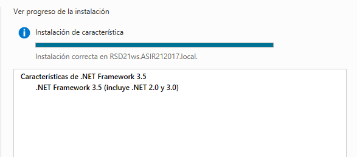
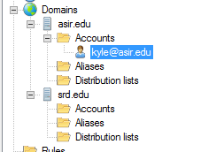
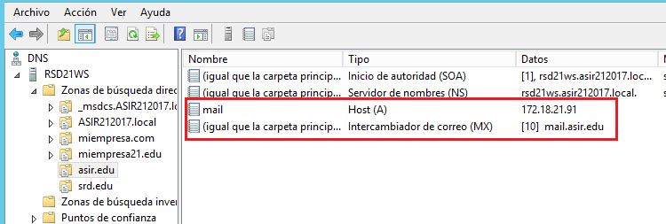
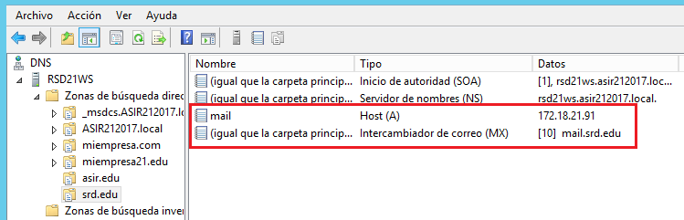

# Servidor de Correo hMailServer

En esta actividad vamos a configurar el servidor de correo `hMailServer` en nuestra máquina Windows Server 2012. A diferencia de la herramienta que teníamos en IIS esta vez podremos configurar nuestro servidor para correo entrante y saliente.

## 1. Desinstalar el Servidor SMTP previo

Antes de instalar el servidor de correo `hMailServer` tendremos que desinstalar el servidor de correo de Windows 2012 Server. Para hacer esto nos dirigimos desde `Administrador del servidor` a la opción `Quitar roles o características`.

- Quitamos la característica `Servidor SMTP`.

  

  

## 2. Descargamos e instalamos `hMailServer`

Vamos a descargar en nuestro servidor la última versión estable de `hMailServer`, para ello nos dirigimos a su página oficial https://www.hmailserver.com/download

  

Una vez descargado vamos a instalar el programa con sus opciones por defecto.

- En el siguiente paso podemos elegir la base de datos que vamos utilizar, en nuestro caso utilizaremos una base de datos propia generada por el programa.

  

- Establecemos la contraseña.

  

> En el caso de encontrarnos lo siguiente:
>
> 
>
> Tendremos que instalar `.NET framework 3.5` desde `agregar roles`
>
>
>
>

Después de esto ya podremos acceder al servidor.

> **Posible fallo:** Es posible que a la hora de conectarte te muestre un mensaje de que no se puede conectar con la base de datos, en este caso desinstalamos el programa y eliminamos el directorio `C:\Program Files (x86)\hMailServer` y volvemos a reinstalarlo. Los fallos pueden venir a causa de que no teníamos instalado previamente el `.NET framework 3.5`.
>
> 
>
> 

## 3. Creamos nuevos Dominios de Correo

Ahora que ya tenemos instalado `hMailServer` vamos al apartado `Domains` y añadimos un par de dominios nuevos.

- Creamos los dominios `asir.edu` y `srd.edu`.

  

  

## 4. Realizar diagnósticos sobre los dominios

Desde el propio administrador de hMailServer podemos comprobar si nuestros dominios están bien configurados, para ello nos dirigimos a `utilities` -> `Diagnostics`.

- Seleccionamos un dominio, como puede ser `asir.edu` y pulsamos `Start`.

  

  

Encontramos varios errores relacionados con los registros MX que no se encuentran o que no esta especificado el directorio para hacer backups, el primero lo solucionaremos más tarde configurando el DNS pero para arreglar el primero solo debemos dirigirnos a `utilities` -> `Backup`.

- Desde este menú seleccionamos la ruta donde se guardan las copias y seleccionamos que se guarden las opciones, los dominios y los **mensajes**.

  

Una vez hecho esto si hacemos un diagnostico en ambos vemos que ya no nos muestra un error.

## 5. Creación de usuarios

Si queremos crear usuarios en nuestros dominios solo tendremos que ir al dominio que creamos y en el apartado `accounts` clicamos en `add user..`. Vamos a crear dos usuarios en cada uno de los dominios.

- Dominio `asir.edu`:

  - Usuario `kyle@asir.edu`:

    

    Para el usuario `kyle` añadimos la opción `Auto-reply`, que contesta directamente a los mensajes recibidos.

    

    También le añadimos la opción `signature`, en lo que añadimos una firma al final del mensaje.

    

    

  - Usuario `eric@asir.edu`:

    

    Para este usuario habilitamos la opción `Forwarding`, que lo que hace es redireccionar los mensajes al correo que especificamos.

    

    

- Dominio `srd.edu`:

  - Creamos los usuario `kenny` y `stan` con diferentes opciones.

    

## 6. Configuramos el servicio DNS

Vamos a configurar el servicio DNS para poder acceder desde los clientes de una forma sencilla. Para ello vamos a crear dos zonas de búsqueda directa (`asir.edu` y `srd.edu`).

Como vemos en las capturas añadimos los registros tipo `A` y registros tipo `MX` para cada uno de ellos.

Si ahora volvemos al servidor al apartado de `Diagnostics` podemos ver que el dominio `srd.edu` ya esta corregido el error.

Por algún motivo seguramente referido a la poca fiabilidad de la propagación  `DNS` el dominio `asir.edu` sigue mostrando un error respecto a los registros `MX`, pero con un `nslookup` podemos comprobar que funciona correctamente.

> Esperando lo suficiente finalmente se muestra todo correcto en los diagnosticos.
>
> 

## 7. Diferentes configuraciones de hMailServer
