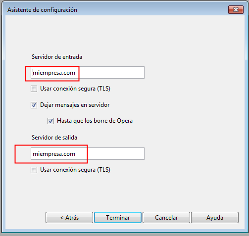
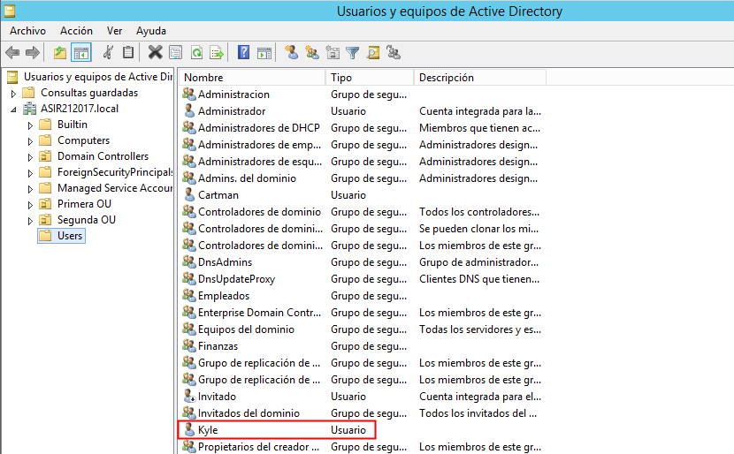
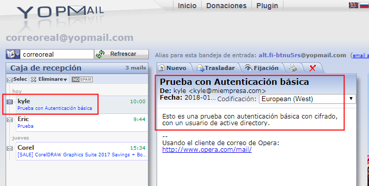
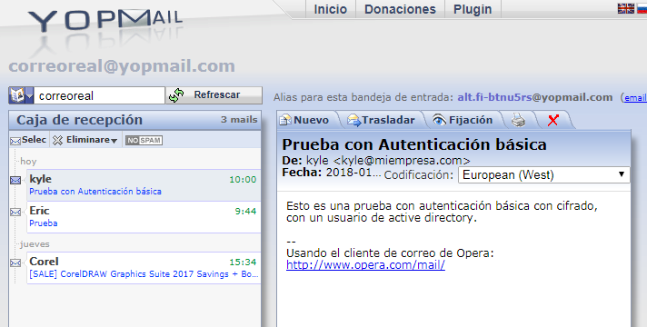

# U6_A1 - Servicio SMTP Windows 2012 Server

En esta práctica vamos a configurar el servicio SMTP en una máquina con Windows 2012 Server.

## 1. Instalación Servicio SMTP en Windows 2012 Server

Para instalar el servicio nos dirigiremos al `administrador del servidor` -> `Agregar roles`.

Desde aquí, en el caso de tener ya instalado el servidor `ISS`, tendremos que avanzar hasta el apartado `características`, donde buscaremos y activaremos la opción `Servidor SMTP`.

Una vez instalado podemos configurar el servicio si accedemos a `herramientas` -> `Administrador de IIS 6.0`.

## 2. Configurando Servicio SMTP

Ahora desde el administrador de `IIS 6.0` vamos a configurar algunos parámetros de nuestro servidor. Hacemos clic derecho en `[SMTP virtual server]` -> `propiedades`.

- Asignamos la dirección IP a todas las no asignadas.
- Limitamos el número de conexiones a '50'.

  

- Habilitamos el registro en formato `W3C`, que se ejecute de forma diaria y lo asignamos a la carpeta `C:\system32\LogFiles`

  

  

- Configuramos la conexión desde nuestra red local y limitamos la conexión a una lista de IPs.

  

  

- Configuramos el envío de mensajes desde nuestra red local y limitamos la conexión a una lista de IPs.

  

  

- Permitimos la autenticación anónima.

  

  

Reiniciamos el servicio para cargar todos los cambios. Una vez hecho esto vamos a comprobar que existe el dominio del `Active Directory` de manera predeterminada.

Comprobado esto vamos a crear un nuevo dominio tipo alias para disponer de cuentas en otro dominio, por ejemplo `miempresa.com`.

Para finalizar vamos a comprobar también que se han creado las carpetas necesarias para el servidor email en la ruta `C:\inetpub\mailroot`.

# 3. Configuración del cliente

Iniciamos una máquina cliente, lo primero que haremos será comprobar que tenemos acceso al nombre DNS que creamos en el servidor (`miempresa.com`).

Vamos ahora a instalar un cliente de email, en este caso instalaremos `Opera Mail`, puesto que es un cliente que no solicita una comprobación del protocolo `POP3`, por lo que podemos utilizarlo para mandar emails con `SMTP`.

Cuando instalemos el cliente vamos a añadir dos cuentas de correo, una vinculada a un usuario de AD y otra que no.

Como servidor de salida escribimos el nombre DNS o la IP de nuestro servidor. En el de entrada pondremos lo mismo, aunque en este caso no exista en nuestro servidor esa opción.

Vamos a probar a enviar un correo a la dirección `stan@miempresa.com`, que en principio no existe.

Si examinamos el directorio `C:\inetpub\mailroot\drop` en nuestro servidor encontraremos que supuestamente se ha enviado un mensaje al correo de `stan@miempresa.com`, es posible que ya existiese esa dirección.

Añadimos ahora el usuario que no existe en nuestro `active directory`.

Mandamos un email nuevamente a una dirección ficticia pero esta vez con el nuevo usuario.

Si examinamos las carpetas en nuestro servidor vemos que este se queda en la carpeta `queue`(cola).

> **NOTA:** A partir de este momento en el servidor la mayoría de las carpetas se quedaron igual, aunque si se enviaban los correos correctamente.

Por último vamos a enviar un correo a una dirección que existe y que podemos comprobar que recibe el mensaje. Para esta tarea utilice la web `www.yopmail.com`, una web que genera correos desechables.

Podemos comprobar que el correo se ha enviado correctamente y que el destinatario lo ha recibido.

# 4. Nueva Configuración en el servidor

Una vez hemos comprobado que la configuración utilizada en las pruebas anteriores ha funcionado vamos aprobar a modificar algunos parámetros en el `administrador de aplicaciones (IIS) 6.0`.

- Cambiamos de autenticación anónima a autenticación básica, para que los únicos que puedan enviar correos sean los usuarios de `AD`. Añadimos que requiera cifrado de `TLS` y el nombre de dominio `miempresa.com`.

  

- Requerimos `cifrado TSL` en el apartado Comunicación segura.

  

Creamos un nuevo correo vinculado al usuario `kyle` de `active directory`.

> Si vamos a los usuarios de active directory podemos comprobar los usuarios que existen y que podemos asociar.
>
>

Esta vez en el momento de seleccionar nuestros servidores de entrada y salida seleccionamos que se utilice una conexión segura (TLS).

## 4.1. comprobaciones

Vamos a realizar unos cuantos correos para comprobar que funciona correctamente.

- El primero lo enviaremos desde nuestro correo `kyle@miempresa.com`, a una dirección real.

  

  - Nos sale un mensaje de que el certificado de TLS puede no ser seguro.

    

  

  Podemos comprobar que el correo llega correctamente a su destino, pero como dije en una anotación anterior las carpetas del servidor siguen sin actualizarse.

- El siguiente correo lo vamos a enviar desde un usuario que no pertenece al `AD` a un correo real.

  

  

  Al intentar enviar el correo este se queda estancado en la pestaña `a enviar` de opera mail y el correo nunca llega.

  

- Por último enviamos un email desde nuestro correo `kyle@miempresa.com` a una dirección que no existe.

  

  En esta ocasión revisando las carpetas del servidor si que podemos encontrar el mensaje en la carpeta `C:\inetpub\mailroot\drop`, aunque debería encontrase en `badmail`, si examinamos el archivo vemos que no se pudo enviar el mensaje.

  

  

Una vez hecho esto podemos dar por finalizada la actividad.
