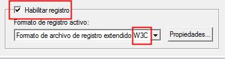

# U6_A1 - Servicio SMTP Windows 2012 Server

En esta práctica vamos a configurar el servicio SMTP en una máquina con Windows 2012 Server.

## 1. Instalación Servicio SMTP en Windows 2012 Server

Para instalar el servicio nos dirigiremos al `administrador del servidor` -> `Agregar roles`.

Desde aquí, en el caso de tener ya instalado el servidor `ISS`, tendremos que avanzar hasta el apartado `características`, donde buscaremos y activaremos la opción `Servidor SMTP`.

Una vez instalado podemos configurar el servicio si accedemos a `herramientas` -> `Administrador de IIS 6.0`.

## 2. Configurando Servicio SMTP

Ahora desde el administrador de `IIS 6.0` vamos a configurar algunos parámetros de nuestro servidor. Hacemos clic derecho en `[SMTP virtual server]` -> `propiedades`.

- Asignamos la dirección IP a todas las no asignadas.
- Limitamos el número de conexiones a '50'.

  

- Habilitamos el registro en formato `W3C`, que se ejecute de forma diaria y lo asignamos a la carpeta `C:\system32\LogFiles`

  

  

- Configuramos el envío de mensajes desde nuestra red local y limitamos la conexión a una lista de IPs.

  

  

- Permitimos la autenticación anonima.

  

  

Reiniciamos el servicio para cargar todos los cambios. Una vez hecho esto vamos a comprobar que existe el dominio del `Active Directory` de manera predeterminada.

Comprobado esto vamos a crear un nuevo dominio tipo alias para disponer de cuentas en otro dominio, por ejemplo `miempresa.com`.

Para finalizar vamos a comprobar también que se han creado las carpetas necesarias para el servidor email en la ruta `C:\inetpub\mailroot`.

# 3. Configuración del cliente
